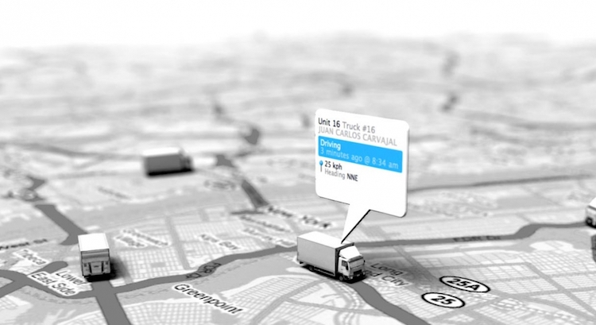
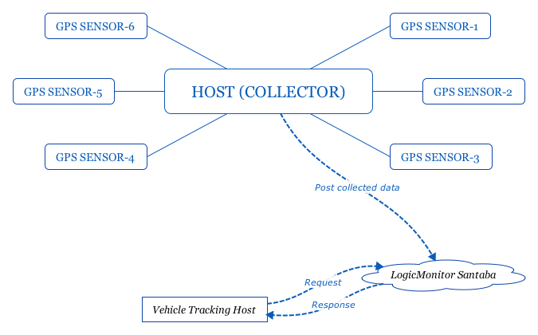
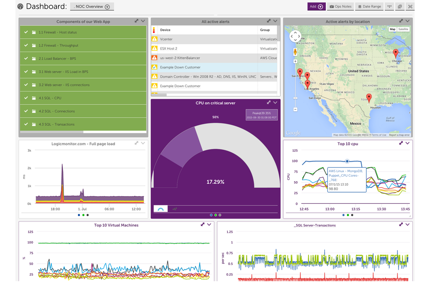

# A great use of Monitoring in GIS world
I have been in GIS business for almost 10 years. Once I come up with [LogicMonitor](https://www.logicmonitor.com), I can easily connect many GIS solutions before with LogicMonitor Platform. You might be surprise that how can an IT infrastructure performance monitor tool be used in a GIS solution. Please allow me to walk you through one of my project before. I will give it a shot one day.

## SaaS-based

As you know, LogicMonitor provides a modern performance monitoring tool for IT infrastructure which is SaaS-based. In another word, we can monitor my devices or anything I'm caring about anywhere in the world through internet. LogicMonitor setups up 6 site monitor locations all around the world which makes a guarantee of the accessibility. On another hand, I don't need to care about my servers maintenance and upgrading when my business grows; I don't need to consider the off-time of my server neither; I don't need to upgrade my monitoring software manually by my self. LogicMonitor Platform  can solve all the problems I have.

## Vehicle Tracking

What the hell is a Vehicle Tracking System? Modern vehicle tracking systems commonly use GPS or GLONASS technology for locating the vehicle, but other types of automatic vehicle location technology can also be used. Vehicle information can be viewed on electronic maps via the Internet or specialized software. In the following content, you will see a fancy idea to integrate the monitoring system into the Vehicle Tracking System.

_What benefit of integrating a such monitoring tool in my solution?_ Where is the pain spot? Let's consider this, when I record the coordinates, I need a time-based database; I need to store it for a period of time; Once my data gets larger, I need to upgrade my servers. When I have many visitors, I need to consider the load balance of loading my data. I need the real-time alerting delivery methods based on some rules etc. LogicMonitor could help you with those things.

Let's first talk about where we want to integrate the monitoring functions in the vehicle tracking system? Here are some scenario.

- Check whether a vehicle is in moving, idled or stopped.
- Record a vehicle's moving trail and can retrieve back by a specified a period of time.
- Send alerting messages in real time based on my preset rules.
- Monitor the usage of the vehicle, like distance to fuel, fuel level, speed, temperature etc.
- Add more...

## Monitoring on board
Where do we start with LogicMonitor? Here is a [brief guide](https://www.logicmonitor.com/support/getting-started/i-just-signed-up-for-logicmonitor-now-what/) for getting started. Basically, we will have one Linux or Windows Server with LogicMonitor connector installed. Then add GPS sensors as [devices](https://www.logicmonitor.com/support/devices/adding-managing-devices/how-do-i-add-devices/) that we want to monitor. We could add as many GPS Sensors (devices) as my business required ([this page](https://www.logicmonitor.com/support/settings/collectors/collector-capacity/) guides to choose a proper collector version based on our monitoring device capacity). Now we have setup our environment as following structure.

The _LogicMonitor Collector_ will automatically discover the GPS instances to monitor. On the other hand, there might be some instances you aware of are not discovered; in this case, we can create our own [ConfigSource](https://www.logicmonitor.com/support/other-logicmodules/articles/creating-a-configsource/) to help LogicMonitor Platform understand the GPS sensor's _"language"_. With this _ConfigSource_, I could use the APIs provided by the GPS sensor provider, write your own groovy script to help our _Collector_ to understand what the GPS sensor says periodically (prints the GPS informations with a set of well formatted string content). We could write script to send back the real-time speed; or coordinate related information. The collector will connect the informations you configured and send back to LogicMonitor who will take care of your data; then you could monitor your devices information in browser all over the world. 

Now, we already get our devices monitored, the next thing is how we use those monitored information. 

A directly peek of the vehicle status is [Dashboard](https://www.logicmonitor.com/support/dashboards-and-widgets/overview/what-are-dashboards/) which allows to collect a customized, strategic view of the systems, presented in the way that is most relevant to you and your business. Imagine you sit comfortable on a chair in front of a big monitor, the real time vehicle status graph is presented to you. Check out a preview of _Dashboard_.

Also, it is easily to [generate a nice report](https://www.logicmonitor.com/support/reports/overview/which-report-should-i-use/) by some objective you are looking to display with graph and tables to send out.

## Use of monitoring raw data outside of LM Platform
LogicMonitor provides a suite of [RESTful API](https://www.logicmonitor.com/support/#developer-guides) for developers as well. With those API, we could easily pick up the monitoring history raw data to use in our own mapping application. Imagine that we can get a vehicle's route coordinates. With this information, we could do many GIS analysis. 

- Draw a route that the vehicle passed in a period of time.
- Check whether the vehicle is in the safe area.
- Check whether the vehicle is in the predefined route way.
- Check the vehicle speed.
- Check whether the vehicle is stoppage at PoI's :)
- Check the distance it drives in a period of time.
- Compare ideal vs. actual usage of the vehicles.
- And more...

All those could help to watch the usage of your vehicles and helps rein in operational costs. Or use those data to analyses your drivers' performance, so that we could avoid some unnecessary accident. That are all monitoring system does, doesn't it?

## Alert in time
The most fantastic thing is about [Alerting](https://www.logicmonitor.com/support/alerts/about-alerts/alerts-page-overview/). We could define the threshold depends on the data of your monitored instance. There are [three levels for the severity](https://www.logicmonitor.com/support/alerts/about-alerts/what-do-the-different-alert-severities-mean/) of the data; LM could strictly [delivers the alerts](https://www.logicmonitor.com/support/alerts/alert-delivery/alert-delivery-methods/) with Email, SMS, Voice Call, or even Configure your own ways when the data is out of range. Like my previous section mentioned, all the items in the list can be collected as a datapoint in the ConfigSource. Each datapoint can set a threshold which defines how the alert triggered, which alert level will be touched and deliver with the predefined ways. 

Pretty cool right? As you can see, it is only a small part of LogicMonitor Platform, it can be used in many industrial fields. What do you want to monitor? Feel free to [contact us](https://www.logicmonitor.com/blog/monitor-ecs-with-config/#chat), I'm sure there will be a way we could help with. 